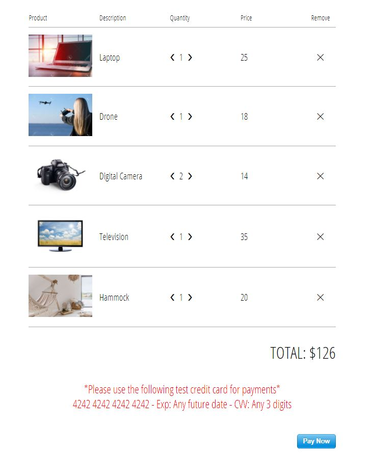
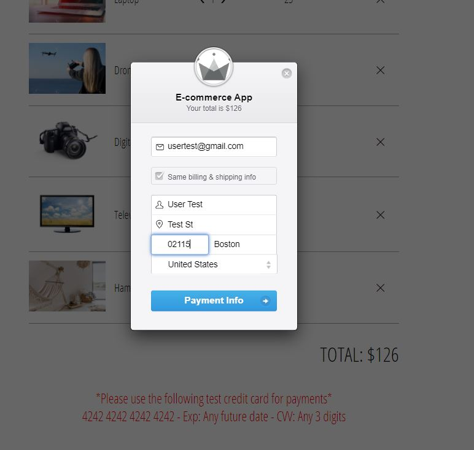
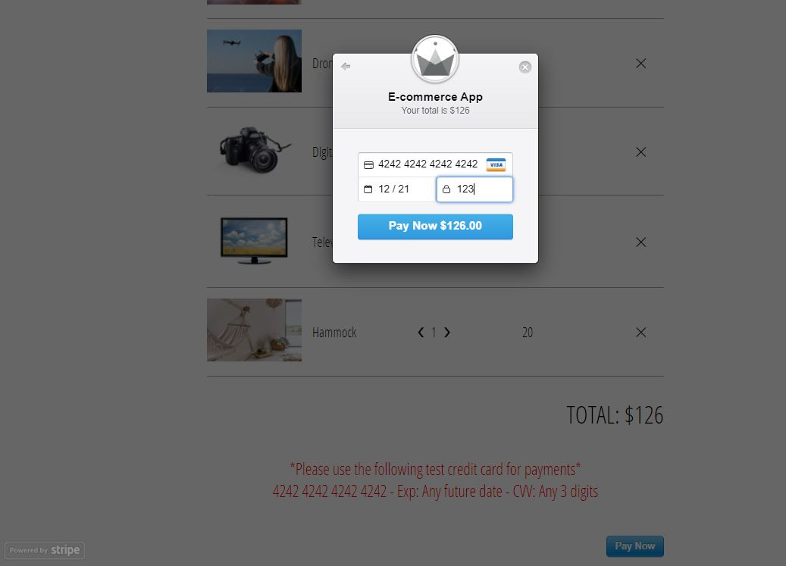
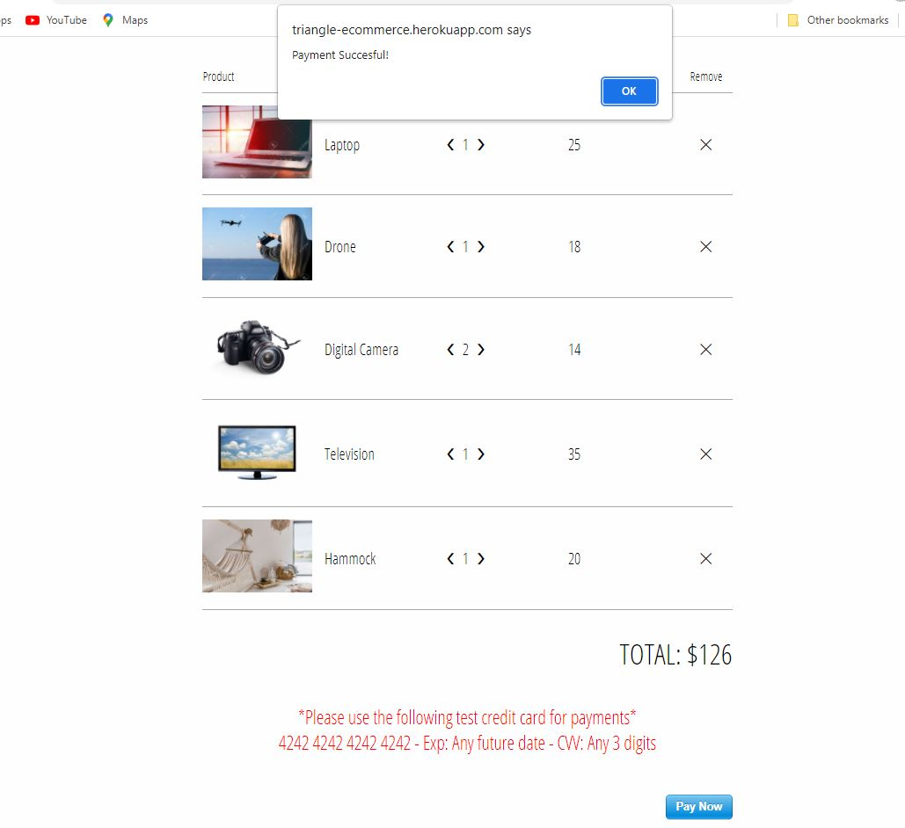

# E-commerce App: Firebase & React
This is a prototype for an e-commerce app. It integrates Firebase for the back-end (service &amp; database), and the Stripe API for processing online payments. The front-end implements reactive programming concepts and techniques.  

**Check out the prototype on heroku: https://triangle-ecommerce.herokuapp.com/**

**Note:** Free trial for the Firebase database will expire soon so DB won't work. Furthermore, when committing to Github the config object from firebase exposed an API key. It is good practice not to expose the API key publicly. Given the intended purpose of showcasing the code for this prototype, this does not present a security issue. The official prototype uses a different API key.

## Features

**Completed**

* Users can create accounts.
* Users can login/logout into/from their accounts.
* Users can add/delete/edit items to/from the shopping cart.
* Users can checkout and make a payment with a credit card (curretnly on test credit card number).

**In Progress**

* To enable managing data with GraphQL: will replace Redux (current state management) with Apollo.

## Tech stack

###Back-End

* Firebase  for server and database.

###Front-End

* React: used create-react-app to set up development environment.
* Yarn (package manager)
* JavaScript and JSX to build out the components for the application in a modular fashion.
* Redux (State management) 
* React Router to set up routes.
* Axios to communicate with the backend.
* Node-SASS to write robust and maintainable CSS.
* Stripe API to process online payments.
* Deployed on Heroku (PaaS).

## Demo Pictures

>Demo 1

>Demo 2

>Demo 3

>Demo 4

>Demo 5

>Demo 6

